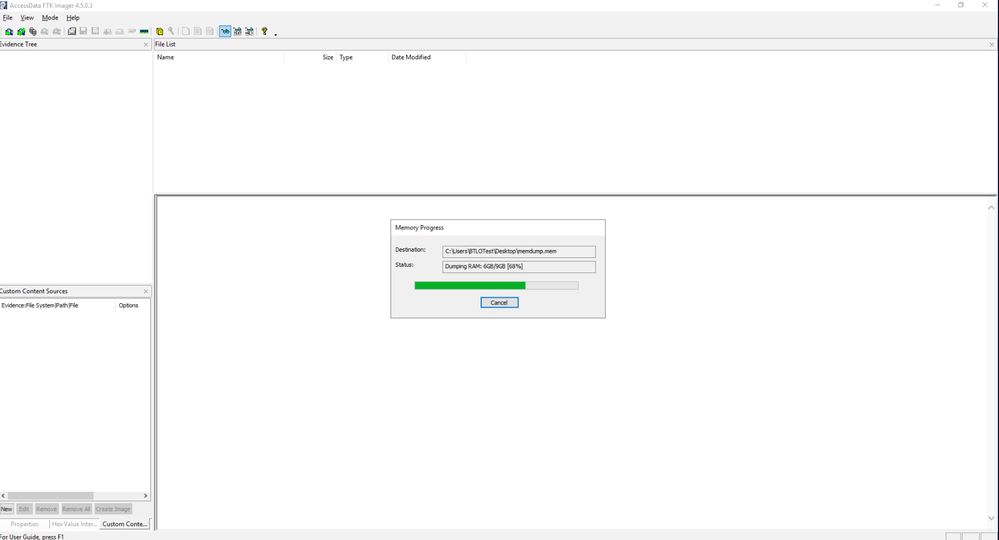
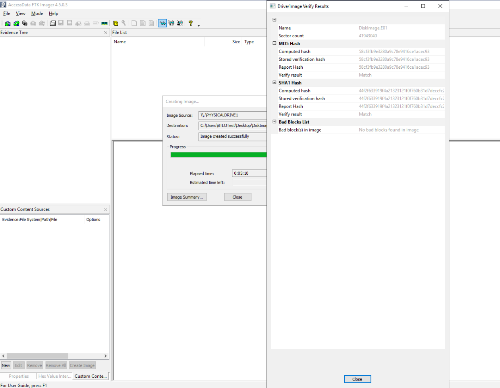
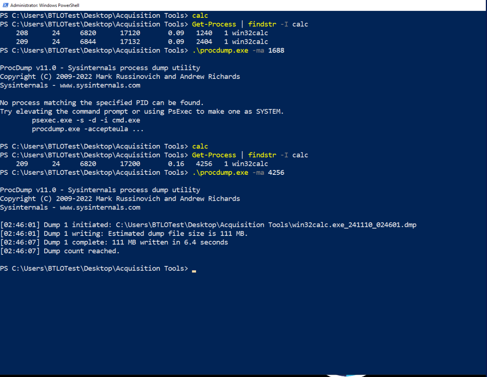
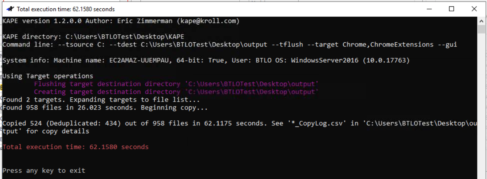
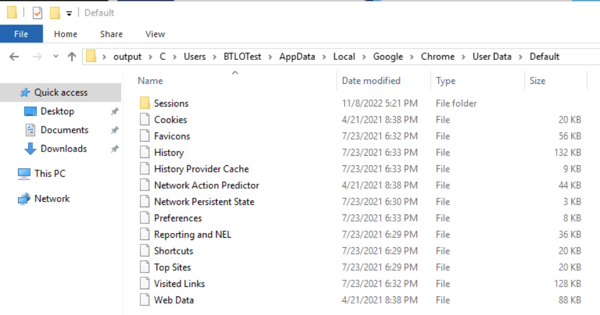

# Digital Data Acquisition Lab with FTK Imager and KAPE

## Objective
Learned foundational skills in digital data acquisition by creating a memory dump, imaging a secondary disk, and collecting key artifacts from a remote host using **FTK Imager** and **KAPE**. This lab focused on acquisition methods in digital forensics, with tasks to retrieve data that can later be analyzed by tools like Autopsy, EnCase, and Volatility.

## Methods
Utilized **FTK Imager** to capture both memory and disk images and employed **ProcDump** to capture a memory dump of a specific process. Connected to a remote host via **RDP** and used **KAPE** to collect essential system artifacts. Each step provided hands-on experience in the acquisition of different types of forensic data.

### Steps
1. **Memory Dump**  
   - Opened **FTK Imager** from the **Acquisition Tools** folder and selected `File > Capture Memory`.
   - Set the destination path to the Desktop to save the memory dump file.
   - Deleted the `memdump` file post-acquisition.
   - Used **ProcDump** (from the Sysinternals suite) in **PowerShell** as an Administrator to acquire a memory dump of the `calc.exe` process.
      - Launched Calculator, identified its Process ID (PID) using `Get-Process | findstr -I calc`.
      - Ran `procdump.exe -ma <PID>` to capture a memory dump.
   - Learned the importance of process-specific memory acquisition in incident response scenarios.

2. **Disk Image Acquisition**  
   - Launched **FTK Imager** again and navigated to `File > Create Disk Image`.
   - Selected **Physical Drive** as the Source Evidence Type and identified the 21 GB drive for imaging.
   - Chose `.E01` as the output file format and saved the image to the Desktop with the name `DiskImage`.
   - Reviewed generated hash values for integrity checks post-acquisition, verifying the image's consistency over time.

3. **Remote KAPE Collection**  
   - Connected to the remote host (10.0.9.225) using **Remote Desktop Protocol (RDP)**, logged in with the provided credentials (`btlo`).
   - Transferred the **KAPE** folder to the remote Desktop and opened **gkape**.
   - Configured KAPE to target the remote system’s **C drive** with the destination set to an `output` folder on the Desktop.
   - Selected Chrome browser-related artifacts and executed the data collection.
   - Retrieved the `output` folder with collected artifacts back to the local Desktop for future analysis.

## Skills Demonstrated
- **Memory Acquisition**: Utilized FTK Imager and ProcDump to create memory dumps, including process-specific dumps.
- **Disk Imaging**: Created a disk image in `.E01` format for forensic analysis, practicing proper hash-based integrity checks.
- **Artifact Collection with KAPE**: Collected browser artifacts from a remote system via KAPE, demonstrating remote forensic data acquisition.
- **Digital Forensic Methodologies**: Practiced methods essential for gathering data for analysis, enabling accurate incident response and forensic investigation.

---

**Screenshots:**  
- 
- 
-  
-  
-  
---

**Summary**  
This lab offered practical experience in core digital acquisition techniques using FTK Imager and KAPE. Through memory and disk imaging as well as remote artifact collection, I gained a foundational understanding of data acquisition in digital forensics. These skills are critical for accurate evidence collection and ensuring data integrity before further forensic analysis.

---
