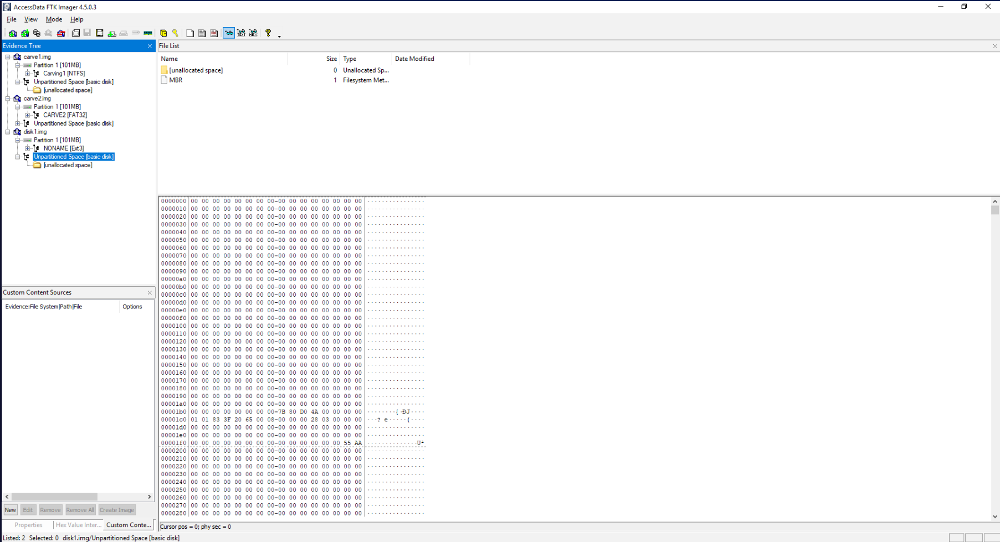

# Disk Image Analysis Lab

## Objective

In this lab, my goal was to analyze three disk images (`carve1.img`, `carve2.img`, and `disk1.img`) to identify the file systems used by the imaged computers.

## Files Used

- `carve1.img`
- `carve2.img`
- `disk1.img`

## Tools Used

- **FTK Imager**: A forensic imaging tool I used to analyze disk images and identify file systems.

## Procedure

### Step 1: Analyzing `carve1.img`

1. I opened FTK Imager.
2. From the main menu, I clicked on **File** > **Add Evidence Item**.
3. I selected **Image File** as the evidence type and browsed to the location of `carve1.img`.
4. After the image loaded, I right-clicked on it and selected **Properties**.
5. Under the **File System** tab, I identified the file system as **NTFS**.

### Step 2: Analyzing `carve2.img`

1. I opened FTK Imager again (if it wasn’t already open).
2. I clicked on **File** > **Add Evidence Item**.
3. I chose **Image File** and selected `carve2.img`.
4. Once the image loaded, I right-clicked on it and selected **Properties**.
5. Under the **File System** tab, I found the file system to be **FAT32**.

### Step 3: Analyzing `disk1.img`

1. I opened FTK Imager once more (if closed).
2. I navigated to **File** > **Add Evidence Item**.
3. I selected **Image File** and browsed to `disk1.img`.
4. After adding the image, I right-clicked on it and selected **Properties**.
5. Under the **File System** tab, I identified the file system as **Linux**.

## Screenshots

Below is a screenshot showing the file system information for all three disk images:

## Summary

In this lab, I used FTK Imager to analyze three disk images (`carve1.img`, `carve2.img`, and `disk1.img`) and determined the file systems used on each. The results were:

- `carve1.img` used **NTFS**.
- `carve2.img` used **FAT32**.
- `disk1.img` used **Linux** file system.

This exercise helped me demonstrate how forensic tools like FTK Imager can be used to identify file systems within disk images, a critical skill in digital forensics.
