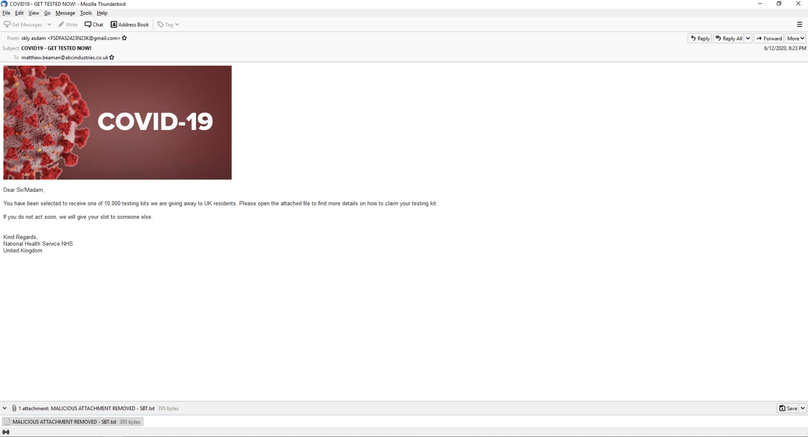
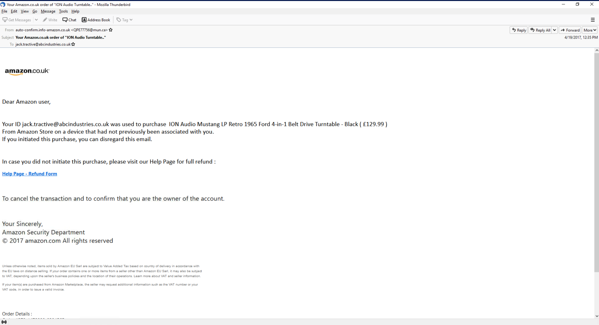
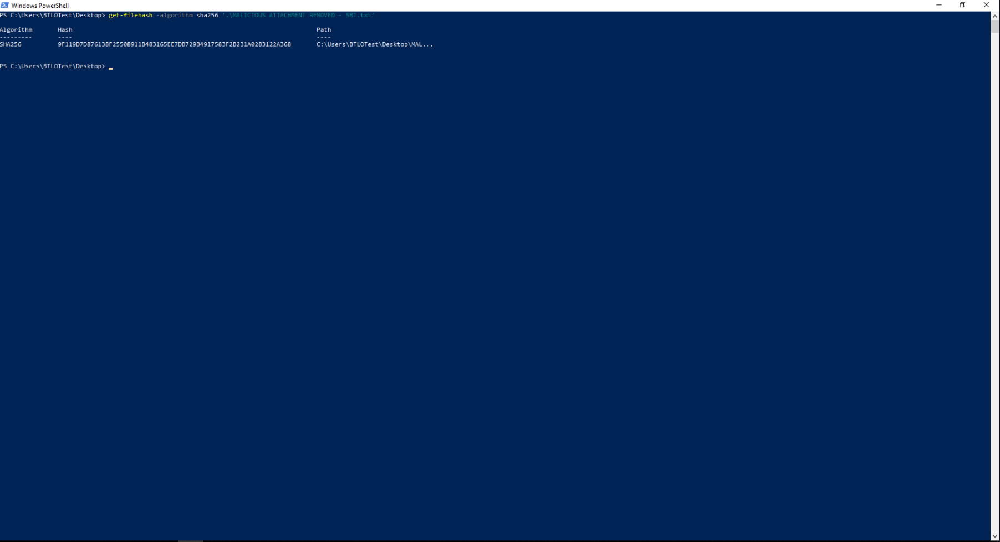
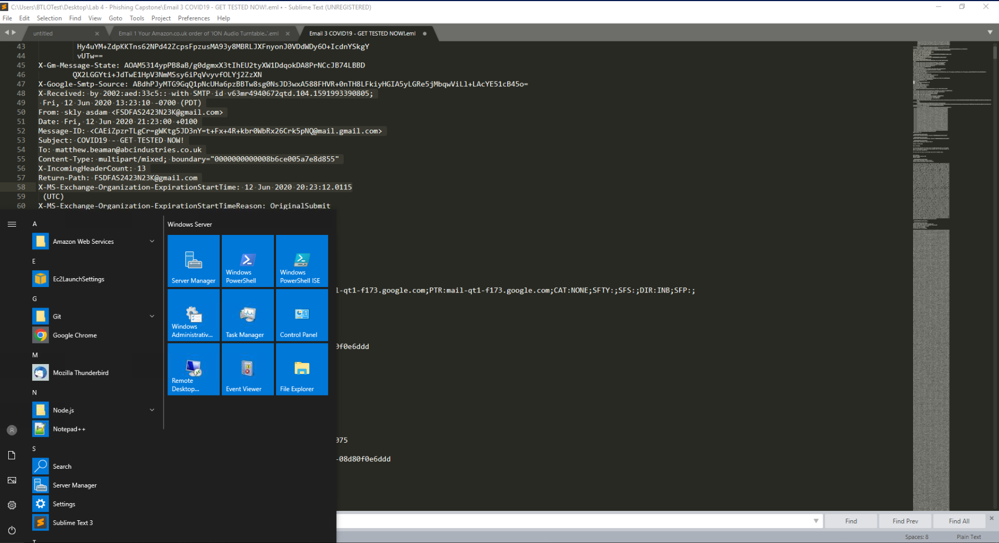
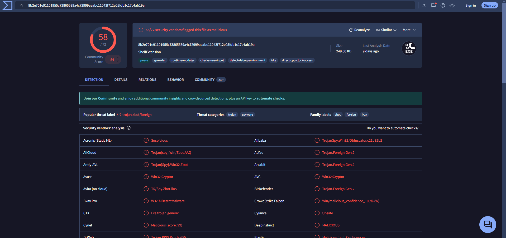
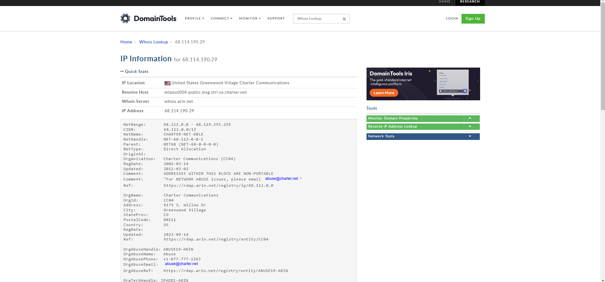

# Phishing Analysis and Response Lab

## Objective
To identify and investigate phishing emails that bypassed the initial security perimeter, extract artifacts, and conduct analysis to determine any potential risks to ABC Industries. This lab tests phishing response skills in preparation for the BTL1 exam.

---

## Skills Learned
- **Email Artifact Analysis**: Extracting and analyzing email metadata, attachments, and headers.
- **Phishing Investigation**: Identifying indicators of phishing and conducting IP and URL analysis.
- **Reporting & Documentation**: Compiling findings into a structured, actionable report.

---

## Lab Details
**Role**: Junior SOC Analyst at ABC Industries  
**Task**: Analyze 5 emails, investigate 2 identified as malicious, and write detailed reports.  
**Tools Used**: SIEM, text editor, WHOis lookup

---
#### Artifacts Analyzed
1. **First Malicious Email**
   - **Sender Email**: QPE77756@mun.ca
   - **Subject**: Your Amazon.co.uk order of "ION Audio Turntable.."
   - **Recipients**: jack.tractive@abcindustries.co.uk
   - **Reply-to Address**: none
   - **Sent Date/Time**: Wed, 19 Apr 2017 12:35:58 +0000
   - **Sender IP**: 68.114.190.29
   - **Reverse DNS Hostname**: mtaout004-public.msg.strl.va.charter.net
   - **Malicious URL**: http://id820update.refundsys59.co.uk/invoice103amz/index.php?email=jack.tractive@abcindustries.co.uk

2. **Second Malicious Email**
   - **Sender Email**: FSDFAS2423N23K@gmail.com
   - **Subject**: COVID19 - GET TESTED NOW!
   - **Recipients**: matthew.beaman@abcindustries.co.uk
   - **Reply-to Address**: none
   - **Sent Date/Time**: Fri, 12 Jun 2020 21:23:00 +0100
   - **Sender IP**: 209.85.160.173
   - **Reverse DNS Hostname**: mail-qt1-f173.google.com
   - **Malicious Attachment**: COVID19-Testing-Kit-2020.pdf.exe
  
## Step-by-Step Process and Screenshots

### Step 1: Initial Email Review
In this step, the email artifacts were reviewed to determine any irregularities that would indicate phishing attempts. This process involved analyzing the email headers, sender addresses, and subject lines to flag suspicious emails.

### Step 2: Identification of Malicious Emails
After reviewing the emails, two emails (Emails 1 and 3) were flagged as suspicious. These emails contained signs such as unknown sender addresses, odd subject lines, and unusual URLs, which warranted further analysis.

### Step 3: Analyzing the First Malicious Email
- **Sender Email**: `QPE77756@mun.ca`  
- **Subject Line**: "Your Amazon.co.uk order of 'ION Audio Turntable..'"  
- **Recipient**: `jack.tractive@abcindustries.co.uk`  
- **Reply-to**: `none`  
- **Timestamp**: Wed, 19 Apr 2017 12:35:58 +0000  
- **Sending Server IP**: `68.114.190.29`  
- **Reverse DNS Hostname**: `mtaout004-public.msg.strl.va.charter.net`  
- **URL**: `http://id820update.refundsys59.co.uk/invoice103amz/index.php?email=jack.tractive@abcindustries.co.uk`

In this analysis, we found that the email was disguised as an Amazon order, but upon further inspection, the sender was from a suspicious domain. The URL contained a potential phishing link that redirected users to a fraudulent page. 

### Step 4: Analyzing the Second Malicious Email
- **Sender Email**: `FSDFAS2423N23K@gmail.com`  
- **Subject Line**: "COVID19 - GET TESTED NOW!"  
- **Recipient**: `matthew.beaman@abcindustries.co.uk`  
- **Reply-to**: `none`  
- **Timestamp**: Fri, 12 Jun 2020 21:23:00 +0100  
- **Sending Server IP**: `209.85.160.173`  
- **Reverse DNS Hostname**: `mail-qt1-f173.google.com`  
- **File Attachment**: `COVID19-Testing-Kit-2020.pdf.exe`  
- **SHA256 Hash**: `8B2E701E91101955C73865589A4C72999AEABC11043F712E05FDB1C17C4AB19A`

This email used the urgency of COVID-19 testing to lure the recipient into downloading a malicious attachment. The `.exe` file disguised as a PDF was flagged during analysis, and the file hash was identified as potentially harmful. Further investigation revealed the attachment to be malware.

### Step 5: WHOis Lookup for Sending Server IPs
WHOis lookup tools were used to investigate the IP addresses associated with the sending servers. This step helped confirm the legitimacy of the sending servers. Both IPs were flagged as suspicious, leading to the conclusion that they were being used to send phishing emails from untrusted sources.

---

## Report Summary
### Artifacts Collected
- **Email Metadata**: Sender, recipient, subject line, timestamps, IP addresses, and DNS hostnames.
- **Attachments and URLs**: Notable malicious links and executables flagged as phishing threats.

### Analysis Activities & Results
- **First Malicious Email**: Disguised as an Amazon order, contained a phishing link that redirects to a suspicious site.
- **Second Malicious Email**: COVID-19 testing lure with an executable attachment. Detected as a potential phishing attempt aimed at downloading malware.

### Defensive Measures
- **Email Filtering**: Implement more robust filters to catch unusual sender addresses and detect known phishing keywords.
- **Security Awareness Training**: Educate employees on recognizing phishing indicators, especially urgent calls to action or unusual file attachments.
- **Attachment Control**: Block potentially dangerous file types (.exe, .js, etc.) to reduce risk.

## Lab Summary
The Phishing Response Challenge Lab involved analyzing a series of phishing emails to identify malicious indicators, assess their risks, and recommend appropriate defensive measures. Through the analysis of email headers, sender information, URL lookups, and attachments, we were able to pinpoint critical signs of phishing attempts, including deceptive sender addresses and executable file attachments. The findings were documented with detailed screenshots, showcasing key analysis steps. Defensive measures were proposed, such as enhanced email filtering, user awareness training, and improved attachment scanning. This lab provided valuable hands-on experience in detecting and responding to phishing threats in a Security Operations Center (SOC) environment.
---

