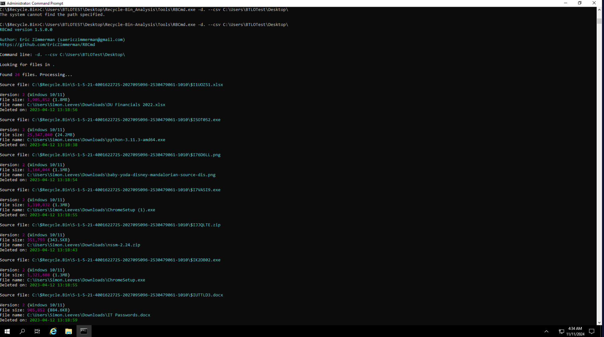

# Windows Investigation: Recycle Bin Analysis

## Objective

This lab focuses on analyzing deleted files within the Windows Recycle Bin using **RBCmd** and viewing the results in **CSVQuickViewer**. The investigation reveals details about the largest deleted files, user activity, deletion timestamps, and user accounts associated with file deletions to identify any unauthorized actions.

## Tools and Techniques

The following tools and methods were used in this investigation:

- **RBCmd**: A command-line tool used to examine Recycle Bin contents and export details to a CSV file.
- **CSVQuickViewer**: A tool for viewing and filtering CSV data, allowing for easier sorting and analysis of the information collected.

## Investigation Process

### Step 1: Generating the CSV Report
- Opened **CMD** as Administrator.
-  Navigated to the Recycle Bin directory and ran **RBCmd** to create a CSV file containing details of deleted files.
   C:\Users\BTLOTest\Desktop\Recycle-Bin-Analysis\Tools\RBCmd.exe -d . --csv C:\Users\BTLOTest\Desktop\
- The command generated a CSV file on the Desktop.

### Step 2: Analyzing the Largest Deleted File
- Opened the CSV file in CSVQuickViewer.
Sorted the FileSize column in descending order to identify the largest deleted file.

### Step 3: Identifying the User with the Most Deleted Files
Filtered the FileName column to group deleted files by file path.
Identified the user with the most deleted files by counting the frequency of unique file paths for each user.

### Step 4: Finding Specific Deletion Timestamps
Located specific filenames within the FileName column in CSVQuickViewer.
Retrieved timestamps by checking the DeletedOn column to determine when particular files were deleted.
[Screenshot Placeholder: CSVQuickViewer highlighting the DeletedOn timestamp for a specified file.]

### Step 5: Associating File Size with User Account
Sorted the FileSize column to locate a specific file size.
Cross-referenced the FileName column to identify the associated user account for that file size.
[Screenshot Placeholder: CSVQuickViewer showing the file size entry and the associated user account.]

### Step 6: Examining Files Related to Unauthorized Data Deletion
Focused on files located within the /Downloads/ folder for a particular user.
Confirmed that files of interest were deleted from the Downloads folder, supporting the theory of unauthorized data handling.

### Step 7: Determining User SID
Located the entry for a specific user in the FileName column.
Noted the SID value, focusing on the last four digits for verification.
[Screenshot Placeholder: CSVQuickViewer displaying the SID value with the last four digits highlighted.]

## Summary
In this investigation, we used RBCmd and CSVQuickViewer to examine deleted files in the Windows Recycle Bin. By analyzing file sizes, deletion times, and user paths, we identified relevant user actions and any potential policy violations. This method effectively isolates specific user activities for further investigation and analysis.
