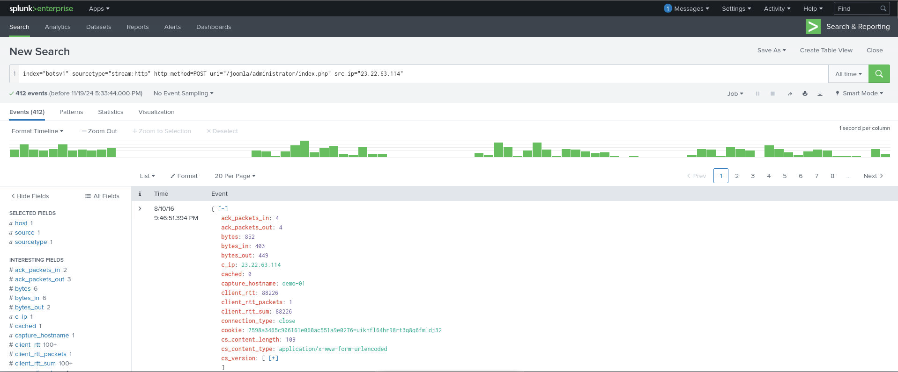
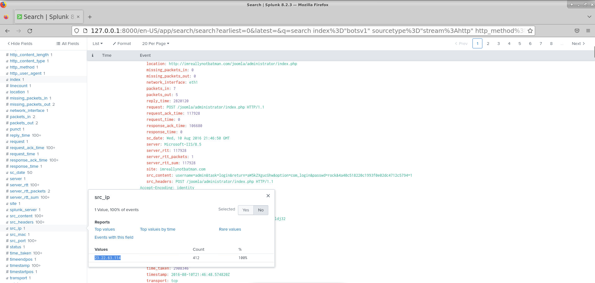
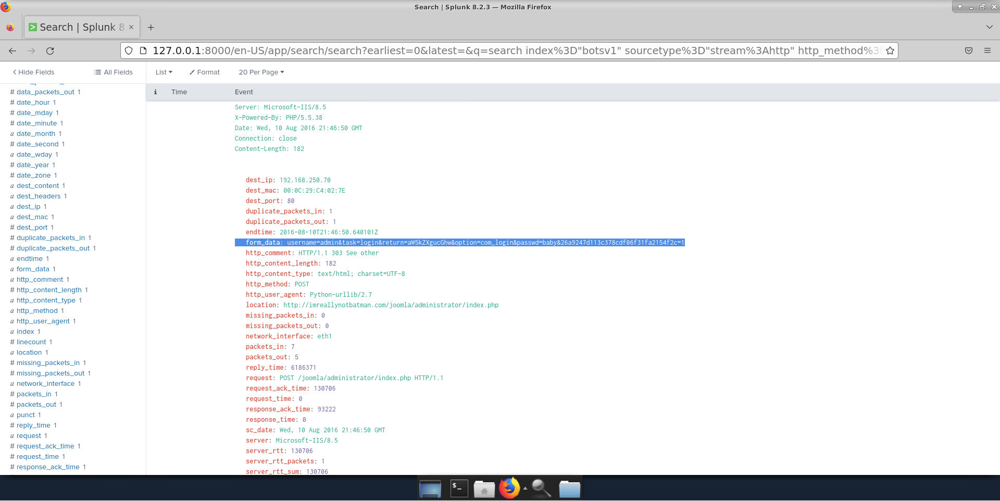
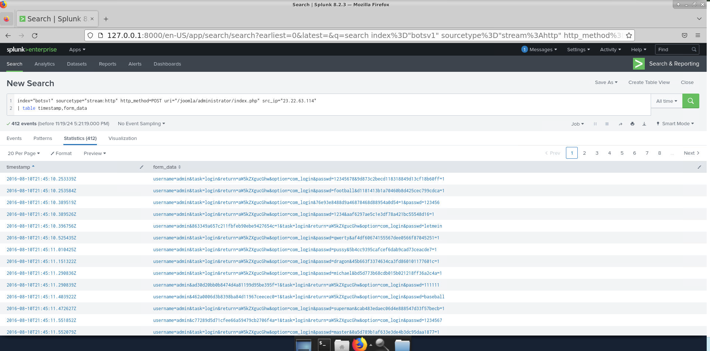

# Brute Force Attack Investigation Lab

## Objective
The goal of this lab is to investigate a brute force attack on a Joomla administrator URL. I used Splunk to analyze HTTP POST requests, determined the source of the attack, check if the attacker was successful in accessing the system, and identified what actions they took.

## Purpose
The purpose of this lab is to familiarize myself with Splunk’s capabilities for investigating network security incidents, particularly brute force attacks. The focus is on using search queries to identify patterns of malicious activity and to analyze related logs to understand the attacker’s behavior.

## Overview
In this lab, I was given an alert regarding a brute force attack against a Joomla administrator page. The attack involves multiple failed login attempts submitted via HTTP POST requests. Using Splunk, I investigated the events to identify the attack’s source IP, check if any credentials were successfully guessed, and determined the first attempted password in the attack.

## What I Learned
- How to utilize Splunk for identifying malicious HTTP POST requests.
- The importance of examining `src_ip` (source IP) and `form_data` (login attempts) to understand attack patterns.
- How to apply various Splunk queries to analyze and visualize logs effectively.

## Key Activities
- **Activity 1**: Searching for HTTP POST requests targeting the Joomla administrator page.
- **Activity 2**: Identifying the source IP address with the highest number of attack attempts.
- **Activity 3**: Analyzing the attempted usernames and passwords submitted by the attacker.
- **Activity 4**: Using Splunk’s table function to organize and view form data related to login attempts.

## Screenshots

1. **Screenshot 1: Initial Search Query**  

2. **Screenshot 2: Source IP Analysis**  

3. **Screenshot 3: Form Data Analysis**  

4. **Screenshot 4: First Password Attempt**  

## Summary
This lab successfully guided the investigation of a brute force attack against the Joomla administrator page. By leveraging Splunk's capabilities to analyze HTTP POST requests, I identified the source IP, determined the credentials attempted by the attacker, and examined the first password submitted. This process allowed me to track the attacker’s behavior and understand their methods.

---
