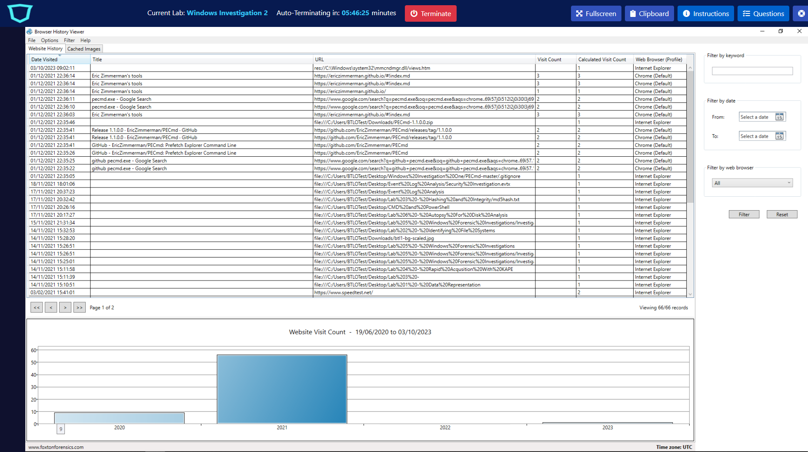
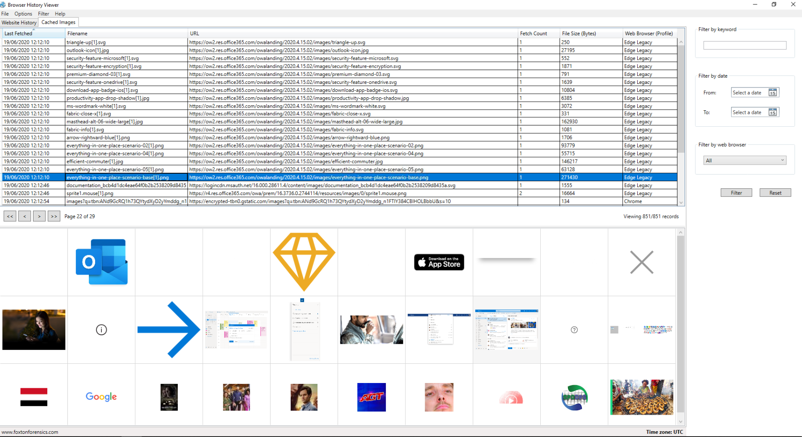
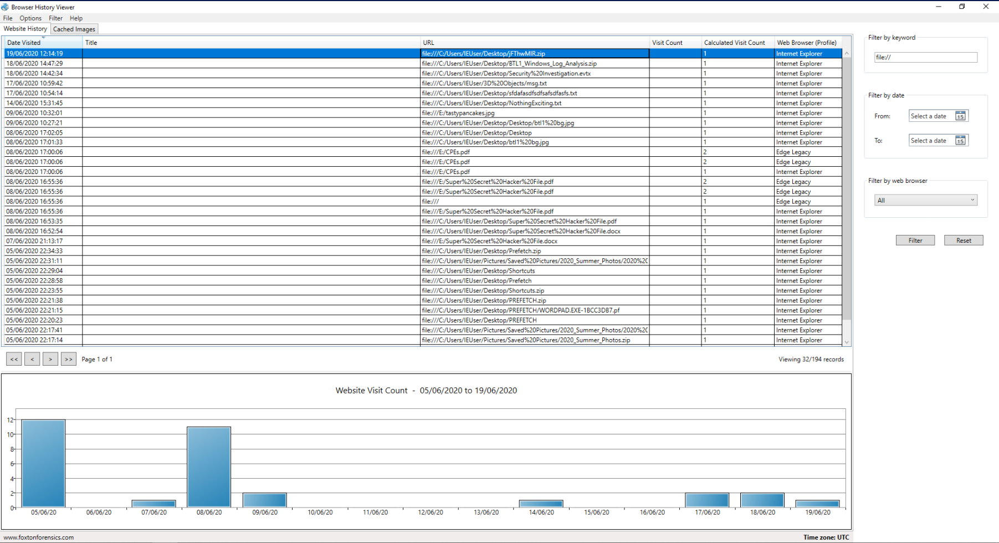
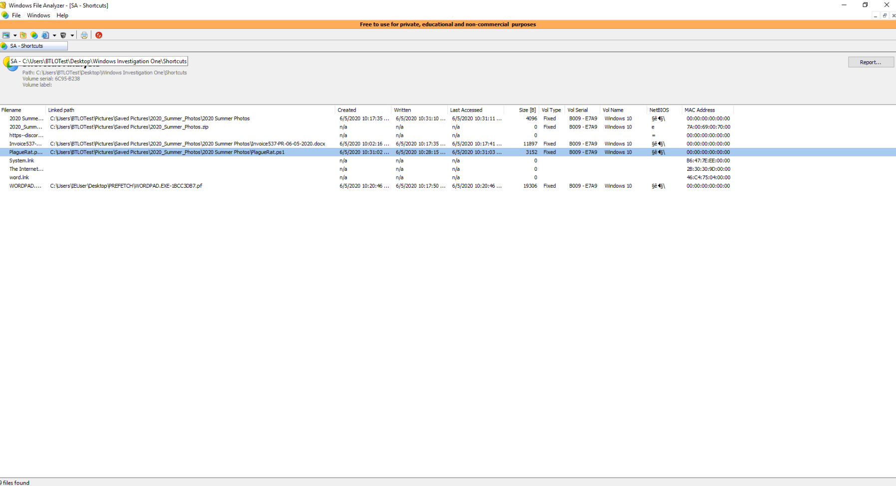

# Windows Investigation Lab Solution

## Objective
The goal of this lab was to investigate user activity on a Windows system by analyzing various artifacts, including browser history, shortcuts, prefetch files, and jump lists. Through this investigation, I was able to reconstruct user actions, identify unauthorized activity, and locate potentially malicious files.

## Tools and Techniques

Throughout this investigation, the following tools and techniques were used:

- **Browser History Viewer (BHV)**: Used to load and analyze browsing history data, which allowed us to identify web browsers used, social media activity, cached images, and URLs visited.
- **Windows File Analyzer (WFA)**: Employed to analyze `.LNK` shortcut files, providing insights into downloaded files and interactions with potential malware.
- **PECmd.exe**: Utilized for parsing Windows Prefetch files, enabling me to track executable usage and confirm the involvement of certain files in suspicious activity.
- **JumpList Explorer**: This tool helped in analyzing Jump Lists, which log application usage and URLs accessed through certain applications.

## Investigation Process
### Part 1: Browser History Analysis
Started by opening **Browser History Viewer (BHV)** and loading the browsing history data to identify web browsers used by the user. Browsing data revealed that the user accessed several social media websites, which was against the company policy.

I then examined the URL column to identify specific sites visited by the user, focusing on identifying social media platforms. The history indicated visits to sites such as Discord, Facebook, Reddit, Twitter, and YouTube.
### Part 2: Cached Images Analysis

The cached images in BHV provided further insights. By filtering through the cached images at specific timestamps, I located an image related to an email, enabling me to view the subject line of the third email.

 

### Part 3: Identifying Malicious Downloads

To trace any suspicious downloads, we searched the BHV records for files with extensions like `.exe` and `.zip`. We identified a ZIP file with an unusual name, which led me to investigate its origin. Based on timestamps and URLs, it appeared this file was downloaded from an external domain through a link likely embedded in an email.

 
### Part 4: Analyzing Shortcuts with Windows File Analyzer

Used **Windows File Analyzer (WFA)** to examine `.LNK` files within the Shortcuts folder. These shortcuts contained information about files previously accessed on the system. Here, I identified a malicious file named **PlagueRat** within a ZIP file and located other files present in the same archive.

 
### Part 5: Prefetch File Analysis with PECmd

Using **PECmd.exe**, I analyzed Prefetch files, particularly focusing on **CMD.EXE-89305D47.pf**. This analysis revealed that the **PlagueRat** batch file had been executed on the system. I also used specific keyword filters to trace applications that interacted with `plaguerat.ps1`.
### Part 6: Jump List Analysis

The final stage involved analyzing the Jump Lists using **JumpList Explorer**. By looking for entries associated with web browsers, I found records indicating a visited website. This confirmed that Microsoft Edge was used to access specific online resources, including URLs potentially linked to malicious activity.
## Summary

This investigation helped me understand the user's interactions with unauthorized websites, downloaded files, and potentially malicious activity on the system. By leveraging a variety of tools and parsing through artifacts like browser history, cached images, shortcut files, prefetch files, and jump lists, I was able to piece together a narrative of the user's actions.

This lab underscores the importance of examining multiple types of forensic evidence to accurately reconstruct events and identify security policy violations. The findings highlight potential gaps in corporate security practices regarding browsing policies and emphasize the necessity of continuous monitoring and education to mitigate risks.
